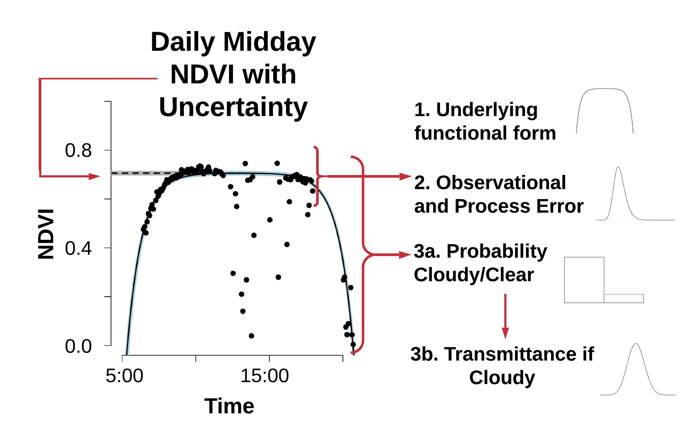
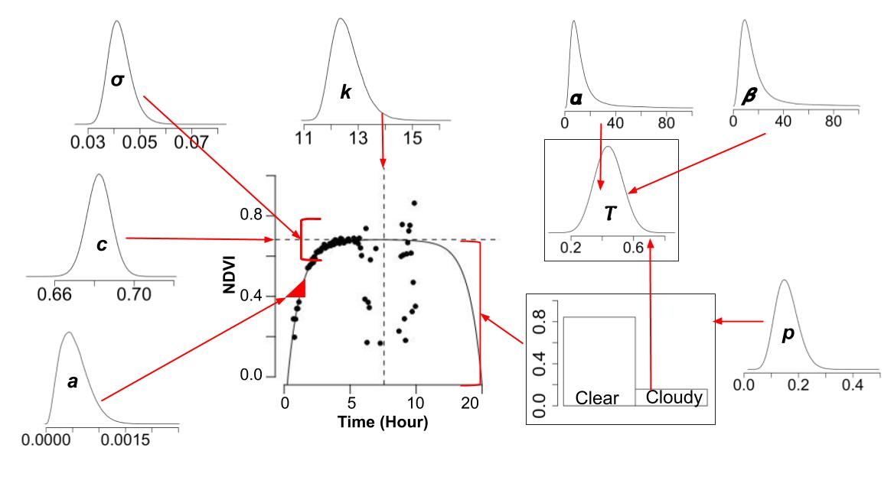
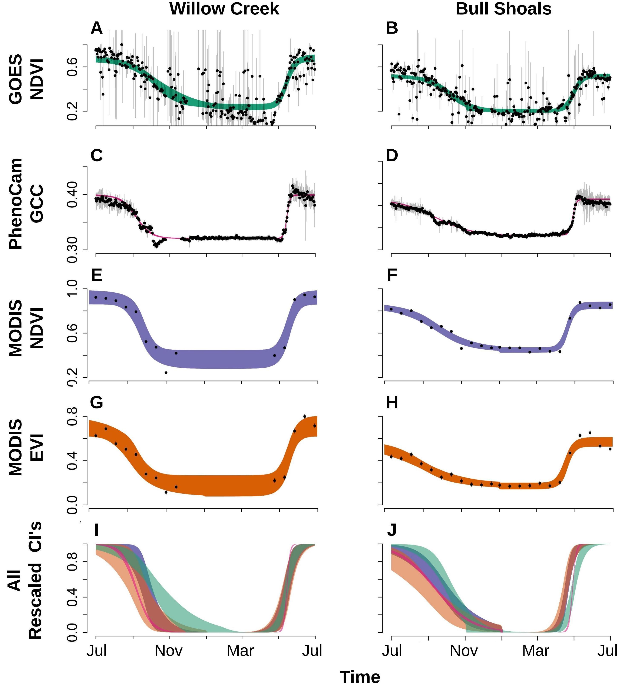

# NEFI_pheno

Code for monitoring and forecasting deciduous broadleaf forest phenology using GOES-16/17 geostationary satellite data. Developed during Kathryn Wheeler's PhD at Boston University (Dietze Lab, 2017–2021).

## Papers

1. **Wheeler, K.I. & Dietze, M.C. (2019).** A statistical model for estimating midday NDVI from the Geostationary Operational Environmental Satellite (GOES) 16 and 17. *Remote Sensing* 11(21): 2507. [doi:10.3390/rs11212507](https://doi.org/10.3390/rs11212507)

  
  

<em>Left: Graphical abstract — extracting daily midday NDVI with uncertainty from the sub-daily GOES signal. Right: Bayesian model structure with posterior distributions for curve shape, cloud probability, and transmittance parameters.</em>

2. **Wheeler, K.I. & Dietze, M.C. (2021).** Improving the monitoring of deciduous broadleaf phenology using the Geostationary Operational Environmental Satellite (GOES) 16 and 17. *Biogeosciences* 18: 1971–1985. [doi:10.5194/bg-18-1971-2021](https://doi.org/10.5194/bg-18-1971-2021)

  

<em>Bayesian phenological curve fits with credible intervals from four data sources (GOES NDVI, PhenoCam GCC, MODIS NDVI, MODIS EVI) at Willow Creek, WI and Bull Shoals, NC. Bottom row shows rescaled credible intervals overlaid.</em>

## Repository structure

### R packages

| Package | Description |
|---|---|
| [`GOESDiurnalNDVI/`](GOESDiurnalNDVI) | Estimates midday NDVI from raw GOES ABI data by fitting diurnal NDVI curves (Paper 1). Includes a [vignette](GOESDiurnalNDVI/vignettes/GOESDiurnalNDVI_vignette.Rmd). |
| [`PhenologyBayesModeling/`](PhenologyBayesModeling) | Bayesian (JAGS) phenological curve fitting and transition date estimation for PhenoCam, MODIS, and GOES time series. |
| [`PhenoForecast/`](PhenoForecast) | Near-term phenology forecasting models with data ingest from PhenoCam, MODIS, ERA5, and NOAA weather stations. |

Install with `install.packages("<dir>", repos = NULL, type = "source")`. Requires [JAGS](https://mcmc-jags.sourceforge.io).

### Paper code

- **Paper 1 (2019):** `GOESDiurnalNDVI/` and `PhenologyBayesModeling/`
- **Paper 2 (2021):** [`GOES_PhenologyPaper_Code/`](GOES_PhenologyPaper_Code) — start with `GOES_Phenology_Paper_Code.Rmd` (rendered `.html` included). Also uses `mainComparingPhenoRS.R` at the repo root. Site metadata is in `GOES_PhenologyPaper_Code/GOES_PhenologyPaper_Data/`.

### Spring phenology forecasting

Developed alongside the Ecological Forecasting Initiative (EFI) NEON forecasting challenge.

| Script | Description |
|---|---|
| `fitSpringPhenoForecasting.R` | Fits spring phenology forecast models, downloading MODIS inputs at runtime |
| `springUncertaintyAnalysis.R` | Partitions forecast uncertainty (model, process, parameter) |
| `springVariancePartitioning.R` | Variance partitioning across the forecast ensemble |
| `makeSpringForecastAnimation.R` | Animated figures of forecast evolution through spring |
| `NEFI_SOBOL_Hindcasts.R` | Sobol sensitivity analysis on phenology hindcasts |

### Other

- `GE509_ClassProject.Rmd` — BU GE509 course project on Bayesian phenology modeling

## Data not included

Raw GOES ABI files (~30 TB), fitted model objects, and forecast outputs are not in this repository. GOES data is downloaded at runtime from NOAA's archive via `GOESDiurnalNDVI::calculateNDVI_GOES_MAIN()`.

## Note

This is archival research code. For current work, see [chlorophyllCycling](https://github.com/k-wheeler/chlorophyllCycling) and [PNW_LULC](https://github.com/k-wheeler/PNW_LULC).

## License

MIT — see [LICENSE](LICENSE).
